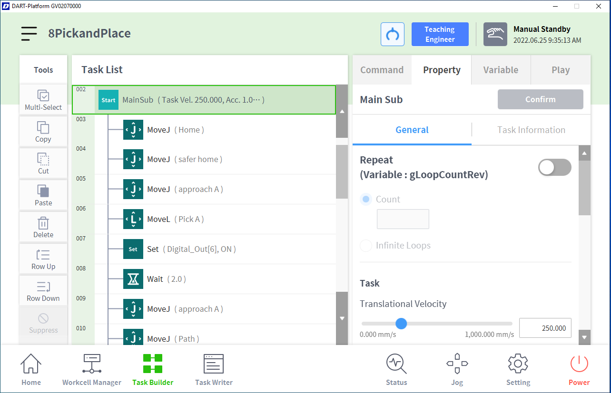
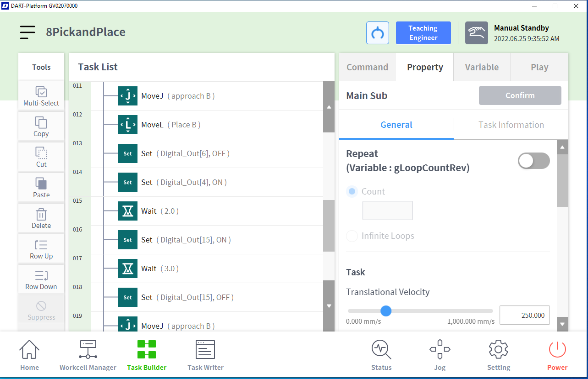
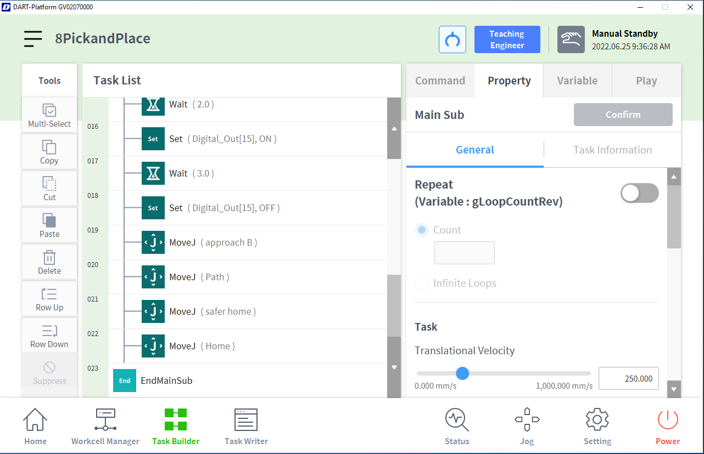
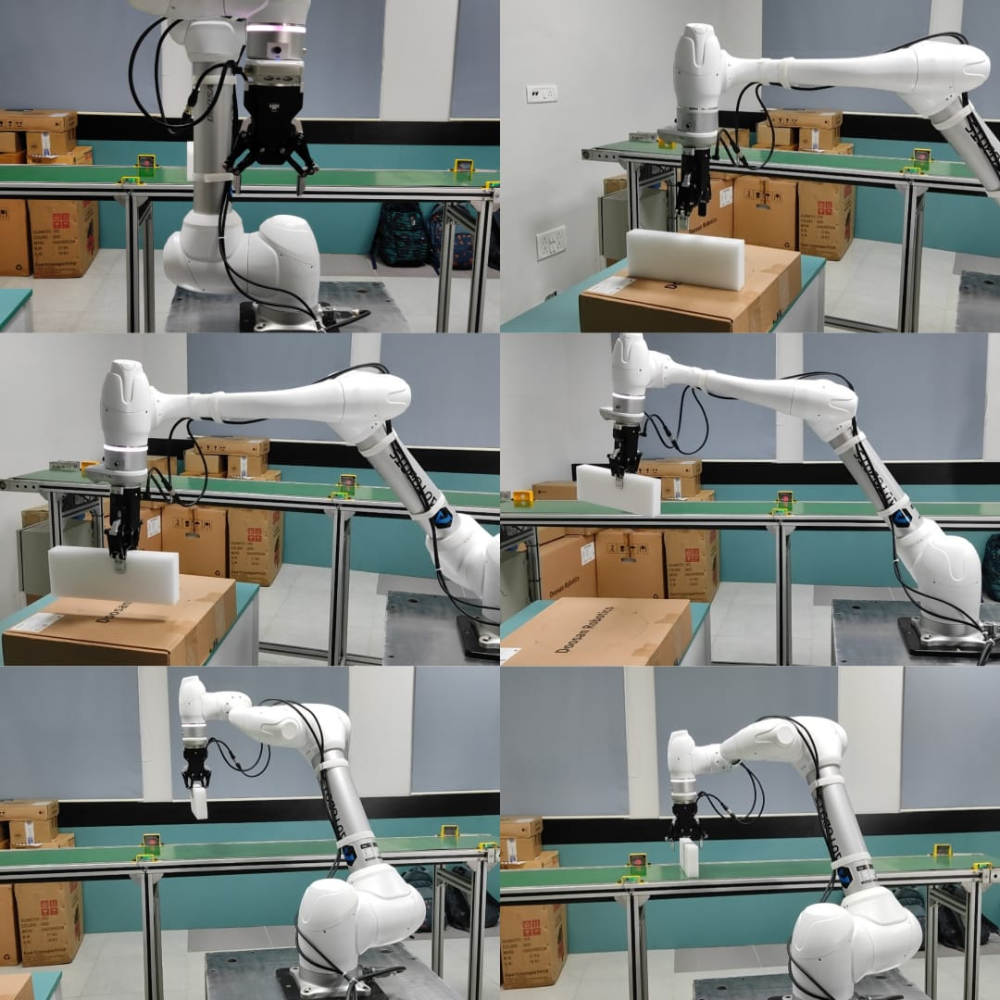

# Experiment-No--08-Execute-a-program-for-pick-place-operations-in-Doosan-Industrial-Cobot-using-DRL-studio
## Aim :
To Execute a program for pick and place operations in Doosan Industrial Cobot using DRL studio.

## Components Required: 
Doosan Industrial Collaborative Robot, 2 jaw gripper ,*DRL (Doosan Robotics Language) Studio Software

## Theory 
Pick and place robots enable companies to use automated solutions for lifting objects from one location and placing them at other locations.

Simple tasks such as lifting objects or moving them do not require a lot of thought processes. Therefore, using human workers on these tasks can be wasteful, as the workforce can be used for other tasks that require higher mental abilities.

These repetitive tasks are handled by pick and place robots. These robots are often equipped with sensors and vision systems to lift objects from moving conveyor belt.

How many axes do a traditional pick and place robot motion can occur?
Simple pick and place robots that lift items and place them at other locations have a 5-axis robotic arm. However, there are also 6-axis robotic arms in use that can twist the items to rotate their orientation.

What are the different parts of a pick and place robot?
A pick and place robot has several dedicated parts, such as:

Robot Arm tool: A robotic arm, also known as a manipulator, is the extension of the robot by using cylindrical or spherical parts. links, and joints.

End Effector: The end effector is the accessory at the end of the robotic arm, that does the required job such as gripping objects. The end effectors can be designed to perform different functionalities based on requirements.

Actuators: Actuators create the motion in the robotic arm and end effectors. The linear actuators are basically any type of motor, such as servo motor, stepper motor, or hydraulic cylinder.

Sensors: You can think of sensors as the eyes of the robots. The sensors do the tasks like identifying the position of the object.

Controllers: Controllers synchronize and control the movement of different actuators of a robot, thereby being the brain behind the smooth robotic operation.

## Procedure:
1) Place the given object on table (Workspace).
2) Use 2 Jaw Gripper to pick the object from P1 (Pick Point). 
3)Move to poin1 using move J
............

## Program 

## output : 

## Result: 
A program for pick and place operations in Doosan Industrial Cobot using DRL studio has been executed successfully.

